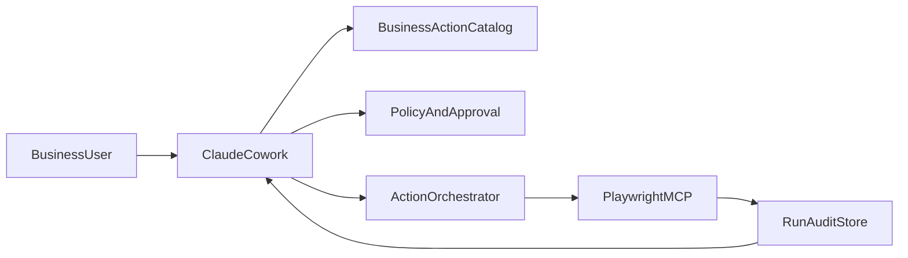

# Claude Cowork Business-Friendly Automation Architecture

## Purpose

This document gives an architect a high-level design for enabling `Claude Cowork` to create and run simple business-facing automation actions using `Playwright MCP`. The goal is to let business users ask for outcomes in plain language while keeping execution controlled, supportable, and safe.

## Business Use Case

Business users should be able to request actions such as:

- `log into a vendor portal and download invoices`
- `look up order status in a web application`
- `enter customer information into a legacy browser-based system`

They should not need to understand selectors, page flows, scripts, or browser automation concepts. `Claude Cowork` should translate the request into a reusable, approved action with simple business inputs.

## Proposed Solution

The recommended pattern is not direct free-form bot generation. Instead, `Claude Cowork` should sit on top of a controlled `Business Action` layer and use `Playwright MCP` as the browser automation execution mechanism.

This gives:

- A simple natural-language experience for the business user.
- A reusable action catalog for common tasks.
- A controlled execution path for browser automation.
- Clear approval, audit, and support boundaries for IT and architecture teams.

## Core Components

### 1. Claude Cowork Experience

`Claude Cowork` is the entry point for the business user. It should:

- Accept requests in business language.
- Suggest existing actions before creating a new one.
- Ask only for business-relevant inputs such as date range, customer number, or portal name.
- Return status and errors in non-technical terms.

### 2. Business Action Layer

Introduce a canonical `Business Action` object that represents the automation in business terms rather than technical browser steps.

Each action should include:

- Action name and plain-language description.
- Required inputs and validation rules.
- Target website or application.
- Preconditions such as required access or available data.
- Risk level and approval requirement.
- Mapping to the underlying `Playwright MCP` execution flow.

This layer is the main contract between the business-facing experience and the technical automation runtime.

### 3. Orchestration And Policy Layer

An orchestration layer should:

- Interpret the user request.
- Resolve it to an existing action or create a draft action proposal.
- Enforce policy and approval rules.
- Invoke `Playwright MCP` for execution.
- Store run history, output, and exceptions.

### 4. Playwright MCP Runtime

`Playwright MCP` should be used as the automation runtime for browser-based tasks. It is appropriate where the target process is primarily performed through web UIs and browser interactions.

It should be responsible for:

- Navigating pages and executing browser actions.
- Reading and writing data from web applications.
- Returning normalized execution results to `Claude Cowork`.

This architecture is best suited for browser automation and should not be presented as a universal replacement for every RPA category.

## Simplified End-To-End Flow

## Key Design Principles

- Use `business actions` as the reusable unit, not raw browser scripts.
- Keep the user experience focused on outcomes and inputs, not automation design.
- Restrict execution to approved action patterns for reliability and governance.
- Treat `Playwright MCP` as the browser execution layer, not the business interface.
- Require review or approval for new, changed, or high-risk actions.

## Architect Considerations

The architect should define:

- The schema for the `Business Action` object.
- Where the action catalog is stored and versioned.
- How `Claude Cowork` invokes `Playwright MCP`.
- Which business processes are in scope for browser automation.
- What approval steps are required before a new action becomes reusable.
- How execution logs, prompts, and outputs are retained for support and audit.

## Security And Governance

- Apply role-based access to action creation, approval, and execution.
- Store credentials in approved enterprise secret storage, not in prompts or action definitions.
- Maintain an audit trail for user intent, generated action mapping, approver, and runtime result.
- Separate pilot, test, and production automation environments where possible.
- Define clear boundaries for which systems may be automated through browser interaction.

## Delivery Approach

### Phase 1: Pilot

- Define the `Business Action` model.
- Connect `Claude Cowork` to `Playwright MCP`.
- Deliver a small set of repetitive, low-risk browser actions.

### Phase 2: Standardize

- Add an action catalog and reusable templates.
- Add approval workflow for new or modified actions.
- Improve business-friendly prompts, validation, and run feedback.

### Phase 3: Scale

- Expand to more departments and web-based processes.
- Improve monitoring, exception handling, and operational support.
- Formalize ownership, lifecycle management, and governance controls.

## Success Measures

- Time for a business user to discover and run an action.
- Reduction in manual effort for targeted browser-based tasks.
- Percentage of requests resolved by existing approved actions.
- Failure rate of production actions and time to resolve incidents.
- Time required to approve and publish a new action.

## Summary

The recommended architecture is a `business-friendly automation layer` in `Claude Cowork` backed by `Playwright MCP` for browser execution. The essential design choice is to expose reusable business actions to end users while keeping automation logic, approvals, and execution controls behind the scenes for the architecture and operations teams.